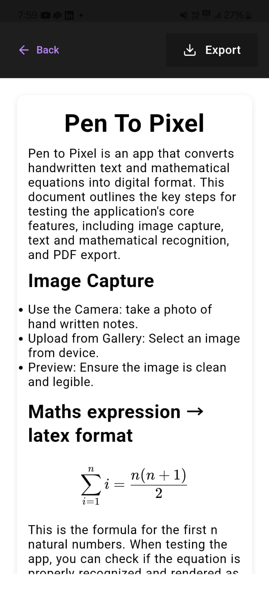

# Pen to Pixel Android App

Pen to Pixel is an Android app that allows users to convert handwritten text and mathematical equations into digital format. Using advanced AI technology, the app processes images of handwritten content and converts them into properly formatted digital text, including LaTeX-rendered mathematical expressions.

## Features

- **Image Capture**: 
  - Take photos using your device's camera.
  - Upload images from your device gallery.
  - Preview images before processing.
  
- **Text Recognition and Processing**: 
  - Converts handwritten text into structured digital text.
  - Recognizes both plain text and mathematical expressions.
  - Maintains formatting and hierarchy of the content.

- **Mathematical Rendering**: 
  - Uses KaTeX for rendering mathematical expressions accurately.
  
- **Export**: 
  - Export the processed content as a PDF file.

## Technical Architecture

- **Frontend**: Built with React JS (for cross-platform Android and iOS compatibility).
- **Backend**: Powered by Google's Gemini AI for text recognition and LaTeX rendering.
- **Android App**: Displays web content and interacts with a local server for file handling and processing. Configured with Kotlin for smooth integration.
- **PDF Export**: LaTeX-rendered content is saved as a PDF for easy sharing and printing.

## Usage

### Image Capture
- Open the app and take a photo of handwritten content using the built-in camera functionality.
- You can also select an image from your device gallery.

### Text Processing
- After capturing or selecting the image, the app will process it using AI to extract and convert the handwritten content into digital format.
- The processed text and mathematical equations are displayed in a clean and formatted view.

### Export to PDF
- Once the content is processed, you can export the result as a PDF document to share or save.

## Error Handling
- **Camera Access Errors**: Users are prompted to enable camera access if it's disabled.
- **Processing Errors**: The app handles any image processing errors and shows an error message.
- **PDF Export Errors**: Any issues with PDF export are communicated to the user.

## Performance Considerations
- Optimized for smooth transitions and memory usage.
- Lazy loading and image optimization are used to ensure optimal performance.

## Future Enhancements
1. Support for multi-page document processing.
2. Batch processing of images.
3. Cloud storage integration for saved files.
4. Enhanced recognition of handwritten mathematical equations.
5. Customizable styling options for the processed content.
6. Offline support for certain features.

---

### Contact

For any questions or issues, please feel free to open an issue on GitHub or contact me at yashgoswamiyg2003@gmail.com.